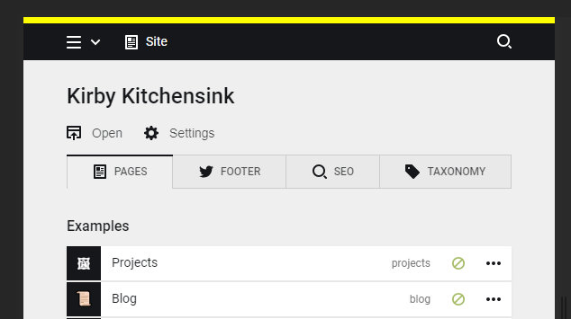

# Kirby Panel Brand

*Version 0.1*

When having multiple environments (local, development and production) and all the panels look the same, it can be easy to be in the wrong Panel.

This plugin add a bar with background color and a text of your choice to make it easier to be alerted when you are in the wrong or right Panel.  



## Installation

Use one of the alternatives below.

### 1. Kirby CLI

If you are using the [Kirby CLI](https://github.com/getkirby/cli) you can install this plugin by running the following commands in your shell:

```
$ cd path/to/kirby
$ kirby plugin:install username/kirby-panel-brand
```

### 2. Clone or download

1. [Clone](https://github.com/username/kirby-panel-brand.git) or [download](https://github.com/username/kirby-panel-brand/archive/master.zip)  this repository.
2. Unzip the archive if needed and rename the folder to `kirby-panel-brand`.

**Make sure that the plugin folder structure looks like this:**

```
site/plugins/kirby-panel-brand/
```

### 3. Git Submodule

If you know your way around Git, you can download this plugin as a submodule:

```
$ cd path/to/kirby
$ git submodule add https://github.com/username/kirby-panel-brand site/plugins/kirby-panel-brand
```

## Setup

## Options

The following options can be set in your `/site/config/config.php` file:

```php
c::set('plugin.panel.brand.text', 'Panel Brand');
c::set('plugin.panel.brand.background', '#ae287f');
c::set('plugin.panel.brand.color', '#fff');
```

### text

Bar text. Letters and numbers are allowed (it used the CSS `content` property).

### background

Bar background color.

### color

Bar text color.

## Changelog

**0.1**

- Initial release

## Requirements

- [**Kirby**](https://getkirby.com/) 2.3+

## Disclaimer

This plugin is provided "as is" with no guarantee. Use it at your own risk and always test it yourself before using it in a production environment. If you find any issues, please [create a new issue](https://github.com/username/kirby-panel-brand/issues/new).

## License

[MIT](https://opensource.org/licenses/MIT)

It is discouraged to use this plugin in any project that promotes racism, sexism, homophobia, animal abuse, violence or any other form of hate speech.

## Credits

- [Jens Törnell](https://github.com/jenstornell)